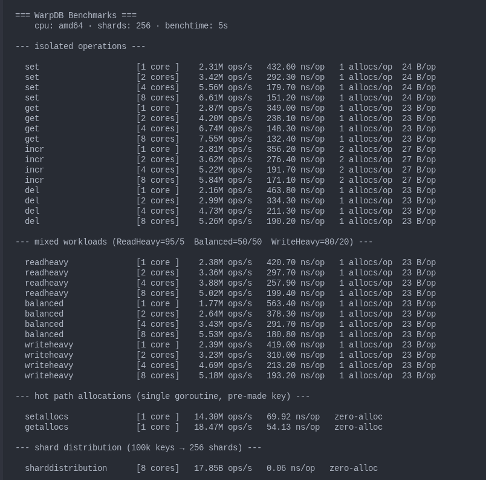

# WarpDB

A Redis-compatible, hybrid in-memory/persistent key-value store written in Go from scratch.
Connects to any Redis client with no changes — `redis-cli`, `ioredis`, `redis-py`, all work out of the box.

```bash
go run ./cmd/main.go
redis-cli -p 6379 SET name Imran
redis-cli -p 6379 GET name
```

---

## Architecture

```
TCP client (RESP)
      │
      ▼
cmd/server              — TCP listener :6379, one goroutine per connection
      │
      ├── core/protocol     — RESP parser and response writers
      └── core/commands     — command dispatch (SET, GET, DEL, INCR, ...)
                │
                ▼
        engine.StorageEngine        — pluggable interface
                │
                ├── WALEngine       — default: logs writes, then applies to memory
                │       ├── wal/WAL         — append-only log with batched fsync
                │       └── MemoryEngine    — in-memory delegate
                │
                └── MemoryEngine    — standalone, no persistence
                        └── core/store.Store  — 256-shard concurrent hashmap
```

### Key design decisions

**256-shard concurrent hashmap**  
Keys are routed to one of 256 shards via FNV-1a hash (`hash & 255`).
Each shard has its own `sync.RWMutex` — contention drops ~256x compared to a single
global lock. Goroutines hitting different keys operate on different shards in parallel.

**Write-Ahead Log with batched fsync**  
Every write is logged before it touches memory. A background flusher goroutine collects
all concurrent writes between wakeups into one batch, writes them all, calls `fsync` once,
then signals every waiting goroutine simultaneously. One `fsync` per batch instead of one
per write — same durability guarantee, orders of magnitude less IO overhead.

**Two-phase locking on reads**  
`Get` and `Exists` take a read lock (phase 1) to copy the value and expiry, then release
it immediately. Only if the key is expired do they re-acquire a write lock (phase 2) to
delete it — and re-check under the write lock to prevent a race where another goroutine
re-set the key between phases. The common path — live key — never takes a write lock.

**Dual-strategy TTL eviction**  
Lazy expiry: every read checks expiry before returning a value.  
Active expiry: a background goroutine sweeps all 256 shards every 100ms, deleting expired
keys even if nobody reads them. Matches Redis `EXPIRE`/`TTL`/`PERSIST` semantics exactly.

**Zero allocations on the hot path**  
`Set` and `Get` cause zero heap allocations when operating on existing keys —
confirmed by `go test -bench -benchmem`. No GC pressure under sustained load.

---

## Supported Commands

| Command | Syntax | Description |
|---|---|---|
| `PING` | `PING [message]` | Liveness check, echoes message if provided |
| `SET` | `SET key value` | Set a key, clears any existing TTL |
| `GET` | `GET key` | Get a value, returns nil if missing or expired |
| `DEL` | `DEL key` | Delete a key |
| `EXISTS` | `EXISTS key` | Returns 1 if key exists, 0 otherwise |
| `INCR` | `INCR key` | Increment integer value, initialises to 0 if missing |
| `DECR` | `DECR key` | Decrement integer value, initialises to 0 if missing |
| `EXPIRE` | `EXPIRE key seconds` | Set TTL in seconds |
| `TTL` | `TTL key` | Remaining TTL in seconds (-1 = no expiry, -2 = missing) |
| `PERSIST` | `PERSIST key` | Remove TTL, make key permanent |
| `KEYS` | `KEYS pattern` | List keys matching glob pattern (`*`, `?`, `[abc]`, `[a-z]`) |
| `FLUSHALL` | `FLUSHALL` | Delete all keys across all shards |

---

## Getting Started

**Requirements:** Go 1.21+, no external dependencies

```bash
git clone https://github.com/imran-binhasan/warpdb
cd warpdb
make build
go run ./cmd/main.go
```

Connect with any Redis client:

```bash
redis-cli -p 6379
```

```
127.0.0.1:6379> SET session:abc user123
OK
127.0.0.1:6379> EXPIRE session:abc 3600
(integer) 1
127.0.0.1:6379> TTL session:abc
(integer) 3599
127.0.0.1:6379> INCR visits
(integer) 1
127.0.0.1:6379> KEYS session:*
1) "session:abc"
127.0.0.1:6379> PING
PONG
```

**Crash recovery:**  
WarpDB writes every mutation to `wal.log` before applying it to memory.
On restart the WAL is replayed to rebuild state:

```bash
go run ./cmd/main.go &
redis-cli -p 6379 SET counter 42
redis-cli -p 6379 INCR counter      # → 43
pkill -f warpdb
go run ./cmd/main.go &
redis-cli -p 6379 GET counter       # → "43" — survived restart
```

---

## Benchmarks

Run on **Intel i5-10300H · Linux · Go 1.26 · 256 shards**  
Keyspace: 100k keys · Value size: 64 bytes · Benchtime: 5s

```
make bench
```



**Isolated operations**

| Operation | 1 core | 2 cores | 4 cores | 8 cores | Latency |
|---|---|---|---|---|---|
| GET | 2.87M/s | 4.20M/s | 6.74M/s | 7.55M/s | 349 ns |
| SET | 2.31M/s | 3.42M/s | 5.56M/s | 6.61M/s | 432 ns |
| INCR | 2.81M/s | 3.62M/s | 5.22M/s | 5.84M/s | 356 ns |
| DEL | 2.16M/s | 2.99M/s | 4.73M/s | 5.26M/s | 463 ns |

GET is ~24% faster than SET under parallel load. On the zero-contention hot path
(single goroutine, pre-made key) the gap is 29%: GET at 18.47M ops/s vs SET at
14.30M ops/s — reflecting the true cost difference between `RLock` and `Lock`.

**Mixed workloads**

| Workload | Ratio | 1 core | 4 cores | 8 cores |
|---|---|---|---|---|
| Read-heavy | 95% GET / 5% SET | 2.38M/s | 3.88M/s | 5.02M/s |
| Balanced | 50% GET / 50% SET | 1.77M/s | 3.43M/s | 5.53M/s |
| Write-heavy | 20% GET / 80% SET | 2.39M/s | 4.69M/s | 5.18M/s |

**Hot path allocations** (single goroutine, pre-made key — store internals only)

| Operation | allocs/op | B/op | ns/op |
|---|---|---|---|
| SET | 0 | 0 | 69.92 |
| GET | 0 | 0 | 54.13 |

The `1 allocs/op` in parallel benchmarks comes from `fmt.Sprintf` in the benchmark
harness generating keys — not from the store itself.

**Shard distribution** (100k keys → 256 shards, FNV-1a)

| | keys/shard |
|---|---|
| avg | 390 |
| min | 317 |
| max | 467 |
| stddev | ~39 (10% deviation from avg) |

No hot shards under uniform key distribution.

---

## Project Structure

```
warpdb/
├── cmd/
│   ├── main.go                  — entry point
│   └── server/server.go         — TCP listener, connection handler
├── core/
│   ├── commands/commands.go     — command dispatch
│   ├── protocol/protocol.go     — RESP parser and response writers
│   └── store/
│       ├── store.go             — 256-shard hashmap, TTL, expiry
│       └── store_test.go        — unit tests and production-grade benchmarks
├── engine/
│   ├── engine.go                — StorageEngine interface
│   ├── memory.go                — pure in-memory engine
│   └── wal_engine.go            — WAL-backed engine
├── wal/
│   └── wal.go                   — append-only log, batched fsync, crash replay
├── scripts/
│   └── fmtbench.awk             — benchmark output formatter
├── Makefile
└── go.mod                       — zero external dependencies
```

---

## Make Targets

```
make build    — compile
make test     — run all tests  
make race     — run tests with Go race detector
make bench    — full benchmark suite with formatted output
make clean    — remove build artifacts and wal.log
```

---

## What's Next

- Binary WAL format with CRC32 checksums (replace JSON, detect corruption)
- WAL segment rotation and compaction
- Additional data types: Lists, Hashes, Sets
- `INFO` command — uptime, connected clients, ops/sec, memory usage
- `CONFIG GET/SET` — runtime configuration without restart